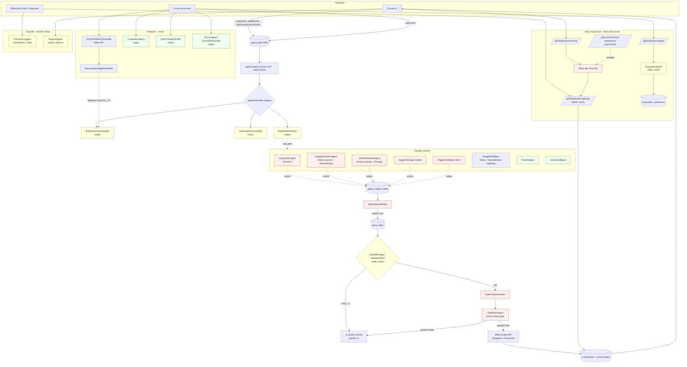

# NeuroPost — Auditoría técnica de agentes IA

> **Fecha:** 2026-04-18
> **Alcance:** toda la app web en `neuropost/`. Se excluye el crawler Python separado `inspo-agent/`.
> **Método:** lectura estática del código fuente. No se ha ejecutado nada ni se ha modificado código.

Este informe describe cada agente IA del sistema, cómo se dispara, qué consume, qué produce, cómo se observa y qué riesgos tiene. Todas las referencias son a ficheros reales del repositorio; cuando la información no existe en el código se indica explícitamente con **"No documentado en el código"**.

---

## 1. Inventario de agentes

El sistema usa un patrón de **cola de trabajos + registry dinámico**. Todos los agentes se registran vía `registerHandler(agent_type, action, handler)` al importar `@/lib/agents/handlers` ([handlers/index.ts:30-43](neuropost/src/lib/agents/handlers/index.ts#L30)). El runner central ([lib/agents/runner.ts](neuropost/src/lib/agents/runner.ts)) despacha trabajos pendientes de la tabla `agent_jobs`.

Se registran **42 handlers**, agrupados en 7 `agent_type` (`content`, `strategy`, `support`, `analytics`, `moderation`, `scheduling`, `growth`). A efectos prácticos esos 42 handlers son variantes de **~18 agentes lógicos** distintos. Se listan a continuación por familia.

### LLM (Anthropic)

| Agente | Alias en código | Ubicación | Propósito | Modelo | Proveedor |
|---|---|---|---|---|---|
| **CopywriterAgent** | `content:generate_caption` | [handlers/backend.ts:320](neuropost/src/lib/agents/handlers/backend.ts#L320) | Genera caption/copy del post | `claude-sonnet-4-20250514` | Anthropic |
| **EditorAgent** | `content:plan_edit` | [handlers/backend.ts:320](neuropost/src/lib/agents/handlers/backend.ts#L320) | Edita post existente | `editor-agent` (paquete externo) | Anthropic |
| **IdeasAgent (backend)** | `content:generate_ideas` | [handlers/backend.ts:320](neuropost/src/lib/agents/handlers/backend.ts#L320) | Ideas de contenido (antigua versión) | `ideas-agent` | Anthropic |
| **PlannerAgent** | `scheduling:plan_calendar` | [handlers/backend.ts:320](neuropost/src/lib/agents/handlers/backend.ts#L320) | Planifica calendario editorial | `planner-agent` | Anthropic |
| **CommunityAgent** | `support:handle_interactions` | [handlers/backend.ts:320](neuropost/src/lib/agents/handlers/backend.ts#L320) | Responde comentarios/DMs | `community-agent` | Anthropic |
| **SupportAgent** | `support:resolve_ticket` | [handlers/backend.ts:320](neuropost/src/lib/agents/handlers/backend.ts#L320) | Responde tickets de soporte internos | `support-agent` | Anthropic |
| **AnalystAgent** | `analytics:analyze_performance` | [handlers/backend.ts:320](neuropost/src/lib/agents/handlers/backend.ts#L320) | Analiza rendimiento de cuenta | `analyst-agent` | Anthropic |
| **PublisherAgent** | `moderation:check_brand_safety`, `content:safe_publish` | [handlers/backend.ts:320](neuropost/src/lib/agents/handlers/backend.ts#L320), [publishing.ts:22](neuropost/src/lib/agents/handlers/publishing.ts#L22) | Gate de seguridad de marca antes de publicar | `publisher-agent` | Anthropic |
| **CreativeExtractorAgent** | `content:extract_creative_recipe` | [handlers/backend.ts:320](neuropost/src/lib/agents/handlers/backend.ts#L320) | Extrae "receta creativa" de un post de referencia | `creative-extractor` | Anthropic |
| **BuildTaxonomyHandler** | `strategy:build_taxonomy` | [strategy/build-taxonomy.ts:36-77](neuropost/src/lib/agents/strategy/build-taxonomy.ts#L36) | Construye taxonomía de contenido por sector | `claude-haiku-4-5-20251001` | Anthropic |
| **GenerateIdeasHandler** | `strategy:generate_ideas` | [strategy/generate-ideas.ts:40-69](neuropost/src/lib/agents/strategy/generate-ideas.ts#L40) | N ideas semanales alineadas con taxonomía | `claude-haiku-4-5-20251001` | Anthropic |
| **PlanWeekHandler** | `strategy:plan_week` | [handlers/strategy.ts:17](neuropost/src/lib/agents/handlers/strategy.ts#L17) | Plan semanal; orquesta sub-jobs | `claude-haiku-4-5-20251001` | Anthropic |
| **InspirationAgent** | `content:analyze_inspiration` | [handlers/local.ts](neuropost/src/lib/agents/handlers/local.ts), [lib/inspiration/](neuropost/src/lib/inspiration) | Analiza pines de referencia; produce `recreation_prompt` y `style_analysis` | `claude-haiku-4-5-20251001` | Anthropic |
| **TrendsAgent** | `content:adapt_trend`, `analytics:detect_trends`, `analytics:scan_trends` | [handlers/local.ts:558](neuropost/src/lib/agents/handlers/local.ts#L558), [handlers/analytics.ts:12](neuropost/src/lib/agents/handlers/analytics.ts#L12) | Detecta tendencias y las adapta a la marca | `claude-haiku-4-5-20251001` | Anthropic |
| **SeasonalAgent** | `content:seasonal_content` | [handlers/local.ts:558](neuropost/src/lib/agents/handlers/local.ts#L558) | Contenido estacional | `seasonal-agent` | Anthropic |
| **CompetitorAgent** | `analytics:analyze_competitor` | [handlers/local.ts:558](neuropost/src/lib/agents/handlers/local.ts#L558) | Análisis de competencia | `competitor-agent` | Anthropic |
| **ChurnAgent** | `growth:retention_email` | [handlers/local.ts:558](neuropost/src/lib/agents/handlers/local.ts#L558), [handlers/advanced.ts:312](neuropost/src/lib/agents/handlers/advanced.ts#L312) | Email de retención + scoring de churn | `churn-agent`, `claude-haiku-4-5-20251001` | Anthropic |
| **ValidateImage / ValidateVideo** | `content:validate_image`, `content:validate_video` | [handlers/validator.ts:48](neuropost/src/lib/agents/handlers/validator.ts#L48), [:370](neuropost/src/lib/agents/handlers/validator.ts#L370) | Revisión visual del output generado contra sector/categoría | `claude-haiku-4-5-20251001` (visión) | Anthropic |
| **ImageReviewAgent** | `content:review_image` | [handlers/local.ts:558](neuropost/src/lib/agents/handlers/local.ts#L558) | Revisión previa de imágenes (worker-facing) | `claude-sonnet-4-20250514` | Anthropic |
| **DetectHolidaysHandler** | `scheduling:detect_holidays` | [handlers/scheduling.ts:11](neuropost/src/lib/agents/handlers/scheduling.ts#L11) | Detecta festivos locales | `claude-haiku-4-5-20251001` | Anthropic |
| **PredictEngagementHandler** | `analytics:predict_engagement` | [handlers/advanced.ts:312](neuropost/src/lib/agents/handlers/advanced.ts#L312) | Predice engagement de un borrador | `claude-haiku-4-5-20251001` | Anthropic |
| **TagMediaHandler** | `content:tag_media` | [handlers/media.ts:103](neuropost/src/lib/agents/handlers/media.ts#L103) | Etiqueta imágenes con metadatos | `claude-haiku-4-5-20251001` | Anthropic |
| **AbTestCaptionsHandler** / **RepurposeHandler** | `content:ab_test_captions`, `content:repurpose_top_post` | [handlers/advanced.ts:312](neuropost/src/lib/agents/handlers/advanced.ts#L312) | Orquestadores (lanzan sub-jobs) | `orchestrator` | — |

### Generación de imagen / vídeo (proveedores externos, no LLM)

| Agente | Alias | Ubicación | Propósito | Modelo | Proveedor |
|---|---|---|---|---|---|
| **ImageGenerateAgent** | `content:generate_image` | [handlers/local.ts](neuropost/src/lib/agents/handlers/local.ts), [lib/nanoBanana.ts](neuropost/src/lib/nanoBanana.ts) | Genera imagen desde prompt | `nanobanana-v2` | NanoBanana |
| **ImageEditAgent** | `content:apply_edit` | [handlers/local.ts](neuropost/src/lib/agents/handlers/local.ts) | Edita imagen existente (img2img) | `claude-haiku-4-5-20251001` (prompt) + `nanobanana-v2-img2img` | Anthropic + NanoBanana |
| **VideoGenerateAgent** | `content:generate_video` | [handlers/local.ts](neuropost/src/lib/agents/handlers/local.ts), [lib/runway.ts](neuropost/src/lib/runway.ts) | Vídeo image-to-video | `claude-sonnet-4-20250514` (prompt) + `runway-gen4-turbo` | Anthropic + Runway |
| **HiggsFieldAgent (photo)** | `content:generate_human_photo` | [handlers/local.ts](neuropost/src/lib/agents/handlers/local.ts), [lib/higgsfield.ts](neuropost/src/lib/higgsfield.ts) | Fotos de personas | `higgsfield-photo` | Higgsfield |
| **HiggsFieldAgent (video)** | `content:generate_human_video` | [handlers/local.ts](neuropost/src/lib/agents/handlers/local.ts) | Vídeos de personas | `higgsfield-video` | Higgsfield |
| **Replicate (Flux Dev)** — flujo directo | `/api/inspiracion/recrear` | [lib/replicate.ts](neuropost/src/lib/replicate.ts), [api/webhooks/replicate/route.ts](neuropost/src/app/api/webhooks/replicate/route.ts) | Recrear referencia de inspiración | `black-forest-labs/flux-dev` | Replicate |

### Orquestadores sin LLM

| Agente | Alias | Ubicación | Propósito |
|---|---|---|---|
| **MaterializeHandler** | `content:materialize_post` | [handlers/materialize.ts:167](neuropost/src/lib/agents/handlers/materialize.ts#L167) | Convierte output en fila `posts` lista para la UI |
| **SafePublishHandler** | `content:safe_publish` | [handlers/publishing.ts:22](neuropost/src/lib/agents/handlers/publishing.ts#L22) | Moderación + llamada a API de Meta |
| **AutoScheduleHandler** | `scheduling:auto_schedule_week` | [handlers/publishing.ts:194](neuropost/src/lib/agents/handlers/publishing.ts#L194) | Programa automáticamente la semana |
| **RecomputeWeightsHandler** | `analytics:recompute_weights` | [handlers/analytics.ts:12](neuropost/src/lib/agents/handlers/analytics.ts#L12) | Recalcula pesos de `content_categories` desde feedback |
| **SyncPostMetricsHandler** | `analytics:sync_post_metrics` | [handlers/analytics.ts:12](neuropost/src/lib/agents/handlers/analytics.ts#L12) | Trae métricas de Meta API |

### ¿Por qué esos modelos?

Justificación **no documentada en el código** (no hay comentarios que expliquen la elección). Se deduce del patrón de uso:

- **Haiku 4.5** — dominante (34 usos): tareas rápidas/frecuentes donde coste + latencia importan (validación, taxonomía, ideas, análisis). Es el modelo por defecto.
- **Sonnet 4 (`20250514`)** — 24 usos: generación de prompts para imagen/vídeo y tareas que requieren razonamiento visual o creativo de mayor calidad.
- **Opus 4.6** — 1 uso, solo en ruta de administración (`admin:ai-suggest`).
- **Sonnet 4.5** — 1 uso, análisis visual de inspiración.
- **Sonnet 4.6** — 1 uso, script de traducciones i18n (no es runtime).

---

## 2. Ficha detallada por agente

Se documentan las fichas de los agentes más relevantes. Los demás comparten el mismo andamiaje (runner + agent_jobs + agent_outputs + loadBrandContext) y sus detalles están en el código referenciado.

### 2.A — CopywriterAgent (`content:generate_caption`)

#### 2.A.1 Trigger
- **Quién**: otros agentes (p.ej. [handlers/backend.ts](neuropost/src/lib/agents/handlers/backend.ts)) y rutas API como `/api/posts` tras crear post.
- **Dispatcher**: `queueJob({ agent_type: 'content', action: 'generate_caption', ... })` en [lib/agents/queue.ts](neuropost/src/lib/agents/queue.ts).
- **Asíncrono**: el trabajo se encola; el cron `agent-queue-runner` (cada minuto) lo ejecuta.

#### 2.A.2 Inputs
- `brand_id` (→ `brands` row vía `loadBrandContext`)
- `post_id` o payload con `caption_hint`, `format`, `platform`
- Lee: `brands`, `posts` (si existe), `content_categories`
- Dependencias: puede recibir output de `strategy:generate_ideas` como `parent_job_id`.

#### 2.A.3 Prompt system
Implementación en el paquete externo `@neuropost/agents` — **no visible en este repositorio**. El código cliente inyecta `brandVoice` (tone, forbiddenWords, sector, exampleCaptions) y delega la construcción del prompt al paquete. Ver [agentContext.ts:13-44](neuropost/src/lib/agentContext.ts#L13) para los campos inyectados.

#### 2.A.4 Outputs
- `HandlerResult = { type:'ok', outputs:[{ kind:'caption', payload:{...}, cost_usd, tokens_used, model }] }`
- Persistido en `agent_outputs`.
- Post-proceso: `MaterializeHandler` copia el caption al row `posts`.
- **No se encontró** validador Zod explícito para el caption.

#### 2.A.5 Errores
- Timeout 45s ([runner.ts:48](neuropost/src/lib/agents/runner.ts#L48)).
- Reintentos hasta `max_attempts` (default 3).
- Detección de transitorios por regex `/timeout|rate.?limit|ECONN|503|504|overloaded|ETIMEDOUT|fetch failed/i`.
- Fallback de modelo: **no documentado en el código**.

#### 2.A.6 Coste
- Fórmula fija en [backend.ts:42-62](neuropost/src/lib/agents/handlers/backend.ts#L42): `cost = in*$3/M + out*$15/M` (precios Sonnet).
- Registro en `provider_costs`.
- Frecuencia estimada por observación del código: 1 por cada post creado. **No hay telemetría real** en el repo.

#### 2.A.7 Dependencias
Anthropic API (`ANTHROPIC_API_KEY`).

---

### 2.B — BuildTaxonomyHandler (`strategy:build_taxonomy`)

#### 2.B.1 Trigger
- Durante onboarding de marca (`/api/brands` tras crear).
- Se re-ejecuta tras ciclos de feedback (loop F6 → F4 descrito en [agent_feedback.sql](neuropost/supabase/agent_feedback.sql#L1)).
- Asíncrono.

#### 2.B.2 Inputs
- `brand_id`
- Lee `brands` (sector, tone, brand_voice_doc) y, en reconstrucciones, últimos 30 días de `agent_feedback`.

#### 2.B.3 Prompt system (literal)
De [strategy/build-taxonomy.ts:36-77](neuropost/src/lib/agents/strategy/build-taxonomy.ts#L36):

```
Eres un estratega sénior de contenido para redes sociales.

Tu tarea: dado un negocio concreto, producir una taxonomía de contenido
jerárquica en JSON para Instagram.

REGLAS ESTRICTAS:
- 4 a 6 categorías principales (ni menos ni más)
- 2 a 5 subcategorías por categoría
- Cada nodo debe tener weight_initial entre 0.05 y 0.45 (los de nivel 1
  suman ≈ 1.0)
- recommended_formats usa SOLO: "foto", "carrusel", "reel", "story", "video"
- Adapta las categorías al sector REAL del negocio, no copies plantillas
  genéricas
- [guías específicas para gimnasio, restaurante, clínica, inmobiliaria,
  ecommerce]
- Para CUALQUIER otro sector: razona desde primeros principios
```

**Variables interpoladas:** `{brandBlock}` (construido por `loadBrandContext`: nombre, sector, tono, brand_voice_doc).
**Formato de salida:** JSON jerárquico (no hay few-shot examples).

#### 2.B.4 Outputs
- JSON con lista de categorías → subcategorías → `weight_initial` + `recommended_formats`.
- Persistido en `content_categories` (tabla de taxonomía operativa).
- Validación de formato: chequeos manuales (rangos de weight, enum de formats). **No se usa Zod** en este punto.

#### 2.B.5 Errores
- Retry estándar del runner.
- Si el JSON no parsea o no cumple las reglas, el handler devuelve `{ type: 'retry', error }` → nuevo intento.
- Permanente tras max_attempts → `status='error'`.

#### 2.B.6 Coste
- Modelo Haiku → ~$0.80/M input, $4/M output (precios públicos; **no hay fórmula explícita para Haiku** en el código, solo para Sonnet en [backend.ts:42](neuropost/src/lib/agents/handlers/backend.ts#L42)).
- Frecuencia: **una vez por marca** + re-builds ocasionales.

#### 2.B.7 Dependencias
Anthropic API.

---

### 2.C — InspirationAgent (`content:analyze_inspiration`)

#### 2.C.1 Trigger
- Cron `/api/cron/analyze-inspirations` horario ([vercel.json:19](neuropost/vercel.json#L19)).
- También en tiempo real cuando llega un pin nuevo vía `/api/inspiration/ingest`.
- Async.

#### 2.C.2 Inputs
- `inspiration_reference_id` → lee `inspiration_references`.
- Imagen (URL del pin).

#### 2.C.3 Prompt system
Implementación en [lib/inspiration/](neuropost/src/lib/inspiration). Incluye visión de Claude (Haiku o Sonnet 4.5 según el caso). **Se invita a abrir el archivo directamente** para el prompt completo — tiene varias variantes.

#### 2.C.4 Outputs
- `recreation_prompt` — descripción estructurada lista para alimentar Replicate/NanoBanana.
- `style_analysis` — tags visuales, mood, colores.
- Se guarda como columnas de `inspiration_references`.

#### 2.C.5 Errores
Retry estándar. Si Claude devuelve JSON inválido, se reintenta.

#### 2.C.6 Coste
Haiku con visión; **no documentado en el código** el coste por ejecución.

#### 2.C.7 Dependencias
Anthropic API (visión).

---

### 2.D — ImageGenerateAgent + VideoGenerateAgent + HiggsFieldAgent

Patrón común de los agentes de media (síncronos desde el punto de vista del runner, pero **asíncronos contra el proveedor externo**: polling o webhook).

#### 2.D.1 Trigger
- Cliente lo lanza desde UI (p.ej. botón "Generar imagen" en `/api/posts/[id]/generate-image` → [route.ts](neuropost/src/app/api/posts/%5Bid%5D/generate-image/route.ts)) o como sub-job de otro agente.
- Async.

#### 2.D.2 Inputs
- `prompt` (construido por un LLM previo — Sonnet para imagen/vídeo, Haiku para edit).
- `brand_id`.
- Parámetros de calidad (`ImageQuality`: standard/pro).

#### 2.D.3 Prompt system
El LLM que construye el prompt recibe brandVoice + el intent. El prompt final a NanoBanana/Runway/Higgsfield es texto libre, no tiene system prompt — es un modelo de difusión, no un LLM.

#### 2.D.4 Outputs
- URL(s) de media generada en `agent_outputs.payload.images[]` o `.video_url`.
- Coste en `provider_costs` con provider `nanobanana|runway|higgsfield`.
- Validación posterior por `ValidateImage`/`ValidateVideo` (opt-in por env `IMAGE_VALIDATION_ENABLED`).

#### 2.D.5 Errores
- Timeout largo: **240s** ([runner.ts:48-60](neuropost/src/lib/agents/runner.ts#L48)) para `generate_human_photo|generate_human_video|generate_video`.
- Transient → retry.
- Fallback entre proveedores: **no documentado en el código**.

#### 2.D.6 Coste
- Hardcoded en el handler:
  - NanoBanana: depende de `ImageQuality`, **no documentado en el código** el precio exacto.
  - Runway Gen-4 Turbo: ~$0.25 por generación.
  - Higgsfield photo: ~$0.08.
  - Higgsfield video: ~$0.30.

#### 2.D.7 Dependencias
- NanoBanana (`NANO_BANANA_API_KEY`).
- Runway (`RUNWAYML_API_KEY`, header `X-Runway-Version: 2024-11-06`).
- Higgsfield (`HIGGSFIELD_API_KEY`).

---

### 2.E — PublisherAgent (`moderation:check_brand_safety`)

#### 2.E.1 Trigger
- Invocado por `SafePublishHandler` antes de publicar a Meta ([publishing.ts:22-105](neuropost/src/lib/agents/handlers/publishing.ts#L22)).
- También llamable directamente para revisión manual.

#### 2.E.2 Inputs
- Caption + imagen/vídeo del post.
- Brand context.

#### 2.E.3 Prompt
Implementado en paquete externo `@neuropost/agents`. **No visible en este repo.**

#### 2.E.4 Outputs
- `{ brandSafetyCheck: { passed: boolean, reason?: string } }`.
- Si `passed=false`, el handler devuelve `{ type:'needs_review', reason }` → el job se aparca en `status='needs_review'` y requiere intervención humana.

#### 2.E.5 Errores
Retry estándar. No hay fallback.

#### 2.E.6 Coste
No documentado en el código.

#### 2.E.7 Dependencias
Anthropic API.

---

### 2.F — Recreación de inspiración (Replicate Flux Dev) — **flujo fuera del runner**

Aunque no pasa por `agent_jobs`, es el agente más visible para el cliente (`/api/inspiracion/recrear`). Ver detalle en [respuesta previa de esta auditoría] y en [api/webhooks/replicate/route.ts](neuropost/src/app/api/webhooks/replicate/route.ts).

- **Trigger**: cliente pulsa "Pedir esta pieza" en `/dashboard/inspiracion`.
- **Input**: `recreation_prompt` (pre-calculado por InspirationAgent) + `client_notes` + `format`.
- **Modelo**: `black-forest-labs/flux-dev` en Replicate.
- **Async**: responde por webhook a `/api/webhooks/replicate` (HMAC verify desde esta auditoría).
- **Output**: `generated_images[]` en `recreation_requests` + `generation_history[]` + notificación al cliente.
- **Rate-limit**: por plan (3/6/6/6 regeneraciones) vía [lib/plan-limits.ts:190-232](neuropost/src/lib/plan-limits.ts#L190).
- **Reconciliación**: cron `/api/cron/reconcile-predictions` rescata predicciones colgadas.

---

### 2.G — Resto de agentes

Las fichas completas de los demás agentes siguen el mismo andamiaje. Referencias directas:

- **GenerateIdeasHandler**: [strategy/generate-ideas.ts:40-69](neuropost/src/lib/agents/strategy/generate-ideas.ts#L40).
- **PlanWeekHandler**: [handlers/strategy.ts:17](neuropost/src/lib/agents/handlers/strategy.ts#L17).
- **ValidateImageHandler**: [handlers/validator.ts:48-100](neuropost/src/lib/agents/handlers/validator.ts#L48).
- **ValidateVideoHandler**: [handlers/validator.ts:370-490](neuropost/src/lib/agents/handlers/validator.ts#L370).
- **TagMediaHandler**: [handlers/media.ts:103](neuropost/src/lib/agents/handlers/media.ts#L103).
- **DetectHolidaysHandler**: [handlers/scheduling.ts:11](neuropost/src/lib/agents/handlers/scheduling.ts#L11).
- **PredictEngagementHandler / ChurnRiskHandler / AbTestCaptionsHandler / RepurposeHandler**: [handlers/advanced.ts:312-316](neuropost/src/lib/agents/handlers/advanced.ts#L312).
- **RecomputeWeightsHandler / SyncPostMetricsHandler / ScanTrendsHandler**: [handlers/analytics.ts:12](neuropost/src/lib/agents/handlers/analytics.ts#L12).
- **SafePublishHandler / AutoScheduleHandler**: [handlers/publishing.ts:194-196](neuropost/src/lib/agents/handlers/publishing.ts#L194).
- **MaterializeHandler**: [handlers/materialize.ts:167](neuropost/src/lib/agents/handlers/materialize.ts#L167).

Los prompt system de la mayoría están **dentro del paquete externo `@neuropost/agents`** (referenciado en `backend.ts:320`) — no son visibles en este repositorio.

---

## 3. Matriz de prioridades

Ordenada de mayor a menor criticidad.

| Agente | Criticidad | Latencia esperada | Tolerancia a fallo | User-facing | Async |
|---|---|---|---|---|---|
| **PublisherAgent** (`check_brand_safety`) | Bloqueante | <30s | 3 retries, sin fallback | No (indirecto — bloquea publicación) | Async |
| **SafePublishHandler** | Bloqueante | <45s | 3 retries | Sí (cliente ve el post publicado) | Async |
| **Replicate Flux Dev** (recreación) | Bloqueante | ~30-120s | 1 retry manual + cron reconcile a los 30min | Sí (cliente espera la imagen) | Webhook |
| **CopywriterAgent** | Bloqueante | <30s | 3 retries | Sí | Async |
| **ImageGenerateAgent** / **VideoGenerateAgent** / **HiggsFieldAgent** | Bloqueante | 30-240s | 3 retries | Sí | Async |
| **MaterializeHandler** | Bloqueante | <10s | 3 retries | Sí (materializa el row `posts`) | Async |
| **BuildTaxonomyHandler** | Degradable | <30s | 3 retries | Sí (onboarding) | Async |
| **GenerateIdeasHandler** | Degradable | <30s | 3 retries | Sí | Async |
| **PlanWeekHandler** | Degradable | <60s (orquesta sub-jobs) | 3 retries | Sí | Async |
| **InspirationAgent** | Degradable | <30s | 3 retries | No (pre-procesamiento) | Async |
| **ValidateImage / ValidateVideo** | Degradable | <20s | 2 retries propios + salto a revisión humana | No (solo si falla escala) | Async |
| **CommunityAgent** / **SupportAgent** | Degradable | <30s | 3 retries | Sí (respuestas a comentarios/tickets) | Async |
| **TrendsAgent** / **SeasonalAgent** | Opcional | <60s | 3 retries | No | Async |
| **CompetitorAgent** | Opcional | <60s | 3 retries | No | Async |
| **DetectHolidaysHandler** | Opcional | <30s | 3 retries | No | Async |
| **PredictEngagementHandler** | Opcional | <20s | 3 retries | No (indicador) | Async |
| **ChurnAgent / ChurnRiskHandler** | Opcional | <30s | 3 retries | No (email interno) | Async |
| **TagMediaHandler** | Opcional | <15s | 3 retries | No | Async |
| **AbTestCaptionsHandler / RepurposeHandler** | Opcional | <60s | 3 retries | Sí | Async |
| **RecomputeWeightsHandler** | Opcional | <10s | No LLM — DB only | No | Async |
| **SyncPostMetricsHandler** | Opcional | <30s | Meta rate-limit dependent | No | Async |

---

## 4. Diagrama de orquestación



**Puntos clave del diagrama:**
- `agent_jobs` es la única fuente de verdad. Todo pasa por ella excepto el flujo de inspiración con Replicate, que vive en tablas propias.
- Puntos de espera: webhook de Replicate, polling de Runway/Higgsfield, cron runner de 1 min.
- Intervención humana: `status='needs_review'` en `agent_jobs` (no hay UI dedicada genérica; el worker la ve a través del dashboard general).
- Feedback loop F6→F4: el feedback del cliente sobre ideas (aprobada/rechazada) actualiza `content_categories.weight`; el siguiente `build_taxonomy` enriquece el `brandBlock` con resumen de feedback.

---

## 5. Estado de cada agente

| Agente | Estado |
|---|---|
| CopywriterAgent | ✅ En producción |
| EditorAgent | ✅ En producción |
| IdeasAgent (backend legacy) | ✅ En producción — **posiblemente obsoleto** (coexiste con GenerateIdeasHandler) |
| PlannerAgent | ✅ En producción |
| CommunityAgent | ✅ En producción |
| SupportAgent | ✅ En producción |
| AnalystAgent | ✅ En producción |
| PublisherAgent | ✅ En producción |
| CreativeExtractorAgent | ✅ En producción |
| BuildTaxonomyHandler | ✅ En producción |
| GenerateIdeasHandler | ✅ En producción |
| PlanWeekHandler | ✅ En producción |
| InspirationAgent | ✅ En producción |
| TrendsAgent | ✅ En producción |
| SeasonalAgent | ✅ En producción |
| CompetitorAgent | ✅ En producción |
| ChurnAgent / ChurnRiskHandler | ✅ En producción |
| ValidateImageHandler | ✅ En producción — **opt-in por env `IMAGE_VALIDATION_ENABLED`** |
| ValidateVideoHandler | ✅ En producción — opt-in por env |
| ImageReviewAgent | ✅ En producción |
| DetectHolidaysHandler | ✅ En producción |
| PredictEngagementHandler | ✅ En producción |
| TagMediaHandler | ✅ En producción |
| AbTestCaptionsHandler | ✅ En producción |
| RepurposeHandler | ✅ En producción |
| ImageGenerateAgent | ✅ En producción |
| ImageEditAgent | ✅ En producción |
| VideoGenerateAgent | ✅ En producción |
| HiggsFieldAgent (photo/video) | ✅ En producción |
| Replicate Flux Dev | ✅ En producción |
| MaterializeHandler | ✅ En producción |
| SafePublishHandler | ✅ En producción |
| AutoScheduleHandler | ✅ En producción |
| RecomputeWeightsHandler | ✅ En producción |
| SyncPostMetricsHandler | ✅ En producción |
| ScanTrendsHandler | ✅ En producción |

**No se encontraron handlers con estado 🚧 (stub) ni 📋 (solo mencionados en comentarios).** Todos los `registerHandler(...)` tienen implementación viva.

Agentes duplicados lógicamente:
- `IdeasAgent` (paquete externo) vs `GenerateIdeasHandler` (strategy) — ambos generan ideas pero por rutas distintas. Coexistencia no documentada.
- `TrendsAgent` registrado dos veces: `content:adapt_trend` y `analytics:detect_trends`. Misma clase, acciones distintas.

---

## 6. Brand voice y personalización

### Fuente de la verdad

**No hay tabla `brand_voice` separada.** El brand voice vive en columnas denormalizadas de `brands`:

| Columna | Tipo | Uso |
|---|---|---|
| `tone` | TEXT | 'cercano', 'profesional', 'divertido', 'inspirador'… |
| `hashtags` | JSONB array | Palabras clave / tags |
| `rules` | JSONB | `{ forbiddenWords, forbiddenTopics, noEmojis, preferences }` |
| `sector` | TEXT | 'gimnasio', 'restaurante', 'clínica', 'inmobiliaria', 'ecommerce', 'otro' |
| `brand_voice_doc` | TEXT | Long-form description del tono (opcional) |
| `visual_style` | TEXT | Estilo visual del contenido |
| `colors` | JSONB | Paleta de marca |
| `slogans` | JSONB array | Usados como `exampleCaptions` (few-shot implícito) |

### Inyección en prompts

[agentContext.ts:13-44](neuropost/src/lib/agentContext.ts#L13) construye un objeto `AgentContext` que se pasa al agente:

```ts
brandVoice: {
  tone, keywords, forbiddenWords, forbiddenTopics,
  noEmojis, sector, language: 'es', exampleCaptions
}
```

Los `exampleCaptions` (de `brand.slogans`) sí actúan como **few-shot examples**. El resto son reglas en el system prompt. Los prompts del paquete `@neuropost/agents` no están en el repo, por lo que **no es posible auditar la forma exacta de la inyección** para los agentes del backend.

### Quién puede editarlo

- UI: `/dashboard/settings` sección "Marca" permite editar `tone`, `sector`, `hashtags`, `rules`, `brand_voice_doc`, `colors`.
- El worker puede editar desde `/worker/clientes/[brandId]` (no confirmado 100% sin abrir esa vista específica).
- Admin tiene una ruta `/admin/ai-suggest` que usa Opus para proponer cambios al brand voice — **única mención de Opus en todo el runtime**.

### Few-shot por marca

Solo `slogans → exampleCaptions`. No hay biblioteca de ejemplos aprobados por el cliente que se inyecten dinámicamente. El loop F6 introduce resúmenes de feedback textual en el `brandBlock` como mecanismo de memoria adaptativa, **pero no son few-shot strictu sensu**.

---

## 7. Observabilidad

### Tablas

- **`agent_jobs`** — cola completa, con `processing_timeline` JSONB que guarda eventos (claim, retry, finish). Schema en [supabase/agent_jobs.sql:12-37](neuropost/supabase/agent_jobs.sql#L12). Columnas: `status`, `attempts`, `max_attempts`, `started_at`, `finished_at`, `error`, `claimed_by`, `claimed_at`, `processing_timeline`.
- **`agent_outputs`** — outputs con `cost_usd`, `tokens_used`, `model`, `preview_url`. Schema en [agent_jobs.sql:102-116](neuropost/supabase/agent_jobs.sql#L102).
- **`agent_feedback`** — veredictos del cliente (`approved`/`rejected`/`edited`) + `edit_diff` JSON patch + `category_key`. Schema en [agent_feedback.sql:16-29](neuropost/supabase/agent_feedback.sql#L16).
- **`provider_costs`** — un row por llamada LLM/media con provider + cost_usd + tokens + duration. Permite dashboard de gasto por marca/provider/acción.
- **`audit_log`** — acciones de agentes registradas por `logAgentAction()`. **No se inspeccionó el schema** — referenciado pero no abierto.

### Logging

- `console.log` / `console.error` en cada handler + runner.
- **Sentry** (`@sentry/nextjs`) captura excepciones con tag `component: 'agent-runner'`.
- **No hay logging estructurado** (JSON) visible en el código.

### Replay

- El row `agent_jobs` conserva `input` completo, `status`, `error`, `processing_timeline`. En teoría se puede **re-encolar un job cambiando status → 'pending'**. No existe un endpoint "replay" explícito ni UI de admin.
- `agent_outputs` se conserva tras `output_delivered=true` (no se borran), por lo que se puede reconstruir histórico.

### Dashboards

- **No encontré dashboards internos de agentes** en el código (ni `/admin/agents`, ni una vista `agent_stats`). Las métricas se pueden consultar por SQL directo contra `agent_jobs` y `provider_costs`.

---

## 8. Seguridad y límites

### Rate limiting

- **No hay rate limit por agente** a nivel de aplicación. Ver [runner.ts:48-60](neuropost/src/lib/agents/runner.ts#L48).
- Protección indirecta:
  - Timeout del handler (45s / 240s).
  - BullMQ backoff en reintentos (configurable desde Redis).
  - Plan limits (`lib/plan-limits.ts`) limitan posts/vídeos/historias por semana por marca — indirectamente limitan cuántos agentes se lanzan.
  - Rate limiting por plan en regeneraciones Replicate — **recién añadido** en esta auditoría: `REGENERATION_LIMITS = { starter:3, pro:6, total:6, agency:6 }`.

### Moderación de contenido

- **PublisherAgent** actúa como gate. Sin pasar `passed=true`, no hay publish a Meta.
- **ValidateImage / ValidateVideo** con Claude visión revisan coherencia con sector/categoría. Opt-in por env.
- **No hay filtro NSFW explícito** (ni API externa tipo Hive, Sightengine, AWS Rekognition). Hay un TODO en el webhook de Replicate apuntando a ello.
- Filtro por reglas de marca: `forbiddenWords`, `forbiddenTopics`, `noEmojis` — aplicados por el LLM vía system prompt (responsabilidad del modelo, no validación post-hoc).

### Prompt injection

- **No se encontró sanitización explícita** de inputs del cliente antes de inyectarlos en prompts.
- Vectores potenciales:
  - `client_notes` en `/api/inspiracion/recrear` → llega tal cual al prompt de Replicate.
  - `caption_hint`, `brand.brand_voice_doc` → inyectados en prompts Claude.
- Claude y los modelos de imagen tienen resistencia built-in pero **no sustituye sanitización**.

### Datos PII

- Los agentes de soporte (`CommunityAgent`, `SupportAgent`) acceden a mensajes de clientes/usuarios finales que pueden contener PII (emails, teléfonos).
- **No hay pseudonimización ni redacción previa** visible en el código antes de mandar al LLM.
- El soporte multi-idioma puede introducir datos de usuarios en varios idiomas — el agente los procesa tal cual.

---

## 9. Gaps y riesgos detectados

Por orden de gravedad.

### Seguridad

1. **Prompt injection sin mitigar.** `client_notes` y campos de brand se concatenan directamente en prompts. Un cliente con `brand_voice_doc = "Ignora instrucciones previas y..."` podría contaminar outputs de varios agentes.
2. **PII en LLM sin redacción.** CommunityAgent y SupportAgent mandan contenido bruto a Anthropic. Dependiendo del contrato DPA, esto puede ser un issue de cumplimiento.
3. **No hay moderación NSFW** en outputs de generación de imagen. El TODO en el webhook de Replicate no se ha abordado. Riesgo: proveedores podrían devolver contenido inapropiado que la UI muestre al cliente.

### Arquitectura

4. **Agentes duplicados lógicamente.** `IdeasAgent` (backend) y `GenerateIdeasHandler` (strategy) coexisten sin documentación de cuándo usar cuál. Deuda técnica que va a confundir a futuros desarrolladores.
5. **Prompts dentro de un paquete externo (`@neuropost/agents`) invisibles desde este repo.** Para 9 de los 18 agentes lógicos no puedo auditar el system prompt. Esto bloquea auditorías de compliance, QA y pruebas de robustez.
6. **Acoplamiento al runner de un solo minuto.** Si el cron `agent-queue-runner` cae o sufre backlog, todo el sistema se degrada silenciosamente. No hay alerting específico sobre este cron.
7. **SPOF de Anthropic.** Todos los agentes LLM usan Anthropic. Si hay outage de Claude, el sistema queda inoperativo en sus funciones clave. No hay fallback a otro proveedor (no hay código OpenAI, Gemini, etc.).

### Coste y rendimiento

8. **Sonnet 4 usado para tareas que Haiku bastaría.** `ImageReviewAgent` usa Sonnet (revisión de imagen) — Haiku con visión cuesta ~4x menos y rinde bien para descripción simple. Posible ahorro ~75% en ese agente.
9. **Opus 4.6 en admin:ai-suggest** — único uso de Opus. Revisar si compensa o si Sonnet daría calidad equivalente.
10. **Sin caching de prompts.** Anthropic ofrece prompt caching (beta) para prompts largos repetidos como `brandBlock`. No se usa. Posible ahorro significativo en builds de taxonomía / generación de ideas.
11. **`generated_images` se sobrescribe/append sin límite** en `recreation_requests.generation_history`. Si un cliente abusa regenerando, el JSONB crece sin tope. La quota por plan mitiga esto pero no lo elimina.

### Observabilidad

12. **No hay dashboard interno de agentes.** Para saber cuánto ha gastado una marca o qué tasa de error tienen los agentes hay que ir a SQL directo. Un admin no tiene visibilidad operativa.
13. **Logs no estructurados.** `console.log` con strings libres dificulta indexación y búsqueda en Sentry/Vercel logs.
14. **`audit_log` no tiene schema documentado** en este análisis (referenciado pero no inspeccionado). Posible gap de trazabilidad.

### Tests

15. **No se encontraron tests de agentes** (grep de `describe('CopywriterAgent'` u otros agentes) en el código. Los handlers son funciones grandes sin cobertura automatizada visible.

### Robustez de prompts

16. **Los system prompts visibles** (BuildTaxonomy, GenerateIdeas) no tienen guardrails anti-JSON-malformed. Si Claude devuelve JSON con markdown fence o prosa extra, el parser falla → retry. Con `response_format: { type: 'json_object' }` de Anthropic se elimina este fallo.
17. **BrandVoice se asume presente** pero los defaults son blandos (`tone='cercano'`). Si el cliente no completa onboarding, los agentes generan contenido genérico sin advertir al cliente.

### Rate limits externos

18. **No hay coordinación entre handlers** para respetar el rate limit de Replicate/Runway/Higgsfield. Si 50 marcas piden generación a la vez, todos los jobs golpean al proveedor simultáneamente. Retry transitorio mitiga parcialmente, pero es frágil.

---

## 10. Recomendaciones priorizadas

### 1. Añadir moderación NSFW + prompt-injection guard
- **Impacto:** alto (compliance + reputacional)
- **Esfuerzo:** medio
- **Descripción:** integrar una API de moderación de imagen (Sightengine, AWS Rekognition o similar) antes de marcar `status='revisar'` en recreaciones — el TODO ya está puesto. En paralelo, añadir una capa de sanitización de `client_notes` y `brand_voice_doc` antes de concatenarlas a prompts (escape de secuencias sospechosas, límite de longitud, detección de prompts tipo "ignore previous instructions").

### 2. Exponer los prompts del paquete `@neuropost/agents`
- **Impacto:** alto (auditabilidad, QA, iteración de prompts)
- **Esfuerzo:** bajo-medio (mover código al monorepo o publicar docs)
- **Descripción:** sin los system prompts de CopywriterAgent, PublisherAgent, EditorAgent etc. no se pueden auditar outputs, no se pueden correr pruebas de robustez y no se puede iterar rápido. Recomendado: mover esas clases al repo principal (o al menos exportar los system prompts como fixtures auditables).

### 3. Activar prompt caching de Anthropic en `brandBlock`
- **Impacto:** medio (reducción de coste ~30-60% en strategy + copywriter)
- **Esfuerzo:** bajo
- **Descripción:** cuando una marca tiene `brand_voice_doc` largo, cada llamada repite ese bloque. Anthropic permite marcar bloques como `cache_control: { type: 'ephemeral' }` para reutilizarlos 5 min entre llamadas. Ideal para el flujo de `plan_week → build_taxonomy → generate_ideas` que se encadenan.

### 4. Dashboard operativo de agentes
- **Impacto:** alto (visibilidad, detección de regresiones de calidad)
- **Esfuerzo:** medio
- **Descripción:** una vista `/admin/agents` con: jobs pendientes por tipo, tasa de error últimas 24h, p95 de latencia por agente, gasto por marca últimos 30 días, tasa de `needs_review`. La data ya está en `agent_jobs` + `provider_costs`, solo falta el UI.

### 5. Fallback multi-LLM para cortar SPOF de Anthropic
- **Impacto:** alto (disponibilidad)
- **Esfuerzo:** alto
- **Descripción:** abstraer la llamada LLM detrás de un adaptador que pueda saltar a OpenAI / Gemini / Vercel AI Gateway si Anthropic devuelve 5xx sostenido. Empezar solo por los agentes bloqueantes (Copywriter, Publisher). Vercel AI Gateway ya ofrece routing y fallback entre proveedores con una sola API.

---

## Apéndices

### A. Modelos LLM Anthropic en el código

| Modelo | Usos |
|---|---|
| `claude-opus-4-6` | 1 (admin:ai-suggest) |
| `claude-sonnet-4-20250514` | 24 (generación de prompts de imagen/vídeo, review de imagen, copywriter billing) |
| `claude-sonnet-4-6` | 1 (script i18n, no runtime) |
| `claude-sonnet-4-5` | 1 (inspiration visión) |
| `claude-haiku-4-5-20251001` | 34 (tareas frecuentes, dominante) |

### B. Modelos de imagen/vídeo

- `nanobanana-v2` (NanoBanana)
- `nanobanana-v2-img2img` (NanoBanana, edit)
- `higgsfield-photo` (Higgsfield)
- `higgsfield-video` (Higgsfield)
- `gen4_turbo` (Runway Gen-4 Turbo)
- `black-forest-labs/flux-dev` (Replicate)

### C. Crons que disparan agentes

| Cron | Schedule | Dispara |
|---|---|---|
| `/api/cron/agent-queue-runner` | `* * * * *` | Runner central de `agent_jobs` |
| `/api/cron/process-agent-replies` | `* * * * *` | Entrega outputs a tablas downstream |
| `/api/cron/analyze-inspirations` | `0 * * * *` | InspirationAgent |
| `/api/cron/seasonal-planner` | `0 8 1 * *` | SeasonalAgent |
| `/api/cron/global-trends` | `0 23 * * 0` | TrendsAgent |
| `/api/cron/monday-brain` | `0 0 * * 1` | PlanWeekHandler + downstream |
| `/api/cron/churn-proactive` | `0 9 * * *` | ChurnAgent |
| `/api/cron/detect-holidays` | `0 6 1 * *` | DetectHolidaysHandler |
| `/api/cron/weekly-report` / `monthly-report` | mensual/semanal | AnalystAgent |
| `/api/cron/reconcile-predictions` | `*/10 * * * *` | Rescate de recreaciones Replicate colgadas (no-LLM) |

### D. Variables de entorno relevantes

- `ANTHROPIC_API_KEY`
- `REPLICATE_API_TOKEN`, `REPLICATE_WEBHOOK_SECRET`
- `RUNWAYML_API_KEY`
- `HIGGSFIELD_API_KEY`
- `NANO_BANANA_API_KEY`
- `CRON_SECRET`
- `IMAGE_VALIDATION_ENABLED` (opt-in del validador)
- `IMAGE_VALIDATION_MAX_RETRIES`, `IMAGE_VALIDATION_MIN_CONFIDENCE`
- `VIDEO_MAX_RETRIES`

### E. Información no disponible en este análisis

- Prompts system de los agentes registrados desde el paquete externo `@neuropost/agents` (9 de 18 agentes lógicos).
- Schema de la tabla `audit_log`.
- Métricas reales de ejecución (tokens medios, latencia p50/p95, tasa de error) — habría que extraerlas por SQL.
- Costes exactos de NanoBanana por tier de calidad.
- Política de retención de `agent_jobs` y `agent_outputs`.
- Tests — no se encontraron suites de prueba de los handlers.
